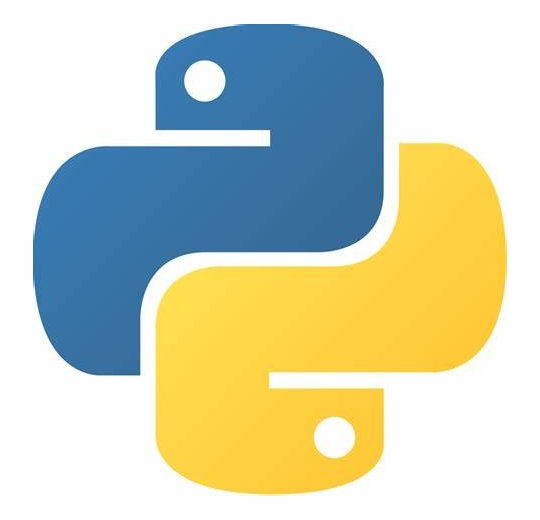

## :snake: Python :snake:

Bienvenido, este es el proyecto de **Python** destinado a guardar todos los conocimientos de este lenguaje de programación y sus diversos usos. En este documento veremos algunas descripciones y lo que veremos en el proyecto.  
**Así que, ¡comenzemos!**

### :thinking: ¿Qúe es es Python?

**Python** es un lenguaje de programación de alto nivel, interpretado y de propósito general. Es conocido por su sintaxis sencilla y legible, lo que facilita el aprendizaje y la escritura de código. Python se utiliza en una amplia variedad de áreas, como desarrollo web, análisis de datos, inteligencia artificial, automatización, ciencia, y más. Además, cuenta con una gran comunidad y una extensa colección de librerías que permiten resolver muchos problemas de manera eficiente.

La información y el aprendizaje fue obtenido principalemente de un video de Youtube el cual se referenciará a continuación. También se muestra el enlace hacia la documentación de **Python** que se puede revisar

[Video de Aprendizaje](https://www.youtube.com/watch?v=ix9cRaBkVe0&t=32712s)  
[Documentación de Python](https://docs.python.org/3/)  

### :white_check_mark: ¿Qué contiene este proyecto sobre Python?

A continuación veremos una descripción de las carpetas que contiene este proyecto:

> 1. **Fundamentos :innocent::** Contiene las bases del lenguaje así como conocimiento de bucles, condicionales y excepciones.
> 2. **Estructuras :building_construction::**  Contiene información de las estructuras en Python como lo son las listas, tuplas o diccionarios.
> 3. **POO :soccer::** Información sobre la Programación Orientada a Objetos que se puede aplicar también en Pyton
> 4. **Proyectos :rotating_light::** Contiene algunos proyectos simples que son posibles de realizar con el conocimiento adquirido. [^1]
> 5. **Anexos :jigsaw::** Contiene algunos temas extras que también pueden ser importantes a la hora de aprender Python.
> 6. **Librerías :closed_book::** Contiene información sobre librerías basicas.[^2]
> 7. **Ejercicios :fountain_pen::** Contiene ejercicios que he realizado sobre todo el aprendizaje que he ido recopilando.

También se tiene la carpeta Recursos donde se colocarán imágenes, links u otras cosas importatnes para el aprendizaje.

Todo el aprendizaje fue hecho en Notebooks de Jupyter Notebooks pero realizado en Visual Studio Code.

[^1]: Los proyectos más grandes serán colocados en repositorios propios de Git Hub
[^2]: Cómo se menciona solo se incluyeron Librerías **Básicas**, pues más adelante en futuros proyectos se aprenderán librerías útiles en recopilación de datos o la muestra de los mismos.

